<picture>
  <source media="(prefers-color-scheme: dark)" srcset="./assets/banners/dark.svg">
  <source media="(prefers-color-scheme: light)" srcset="./assets/banners/light.svg">
  
</picture>

  &nbsp;&nbsp;
  &nbsp;&nbsp;
  

  

  
  

<picture>
  <source media="(prefers-color-scheme: dark)" srcset="https://raw.githubusercontent.com/zaidbharde/zaidbharde/output/github-contribution-grid-snake-dark.svg">
  <source media="(prefers-color-scheme: light)" srcset="https://raw.githubusercontent.com/zaidbharde/zaidbharde/output/github-contribution-grid-snake.svg">
  
</picture>

## Manual setup checklist

1. Create the profile repo named `zaidbharde` under the `zaidbharde` GitHub account and upload this README plus `assets/banners/dark.svg`, `assets/banners/light.svg`, and `.github/workflows/snake.yml`.
2. In this repo, go to Settings > Actions > General > Workflow permissions and select "Read and write permissions". This is the repo setting, not the account setting.
3. Run the "Generate contribution snake" workflow once. Add the snake `<picture>` only after the Action runs green, because the `output` branch does not exist before that.
4. Fork `anuraghazra/github-readme-stats`, create a classic GitHub token from Settings > Developer settings > Personal access tokens > Tokens (classic), choose `repo` scope, no expiration, copy it once, and never paste it publicly.
5. Import the fork on Vercel Hobby, add environment variable `PAT_1` with that token, deploy, then replace `YOUR-GITHUB-README-STATS-VERCEL-APP` above with your Vercel app name.

Note: `hide_rank=true` is intentional. The rank is heavily affected by stars and can be misleading for newer profiles, while the other cards show more useful activity and language signals.
